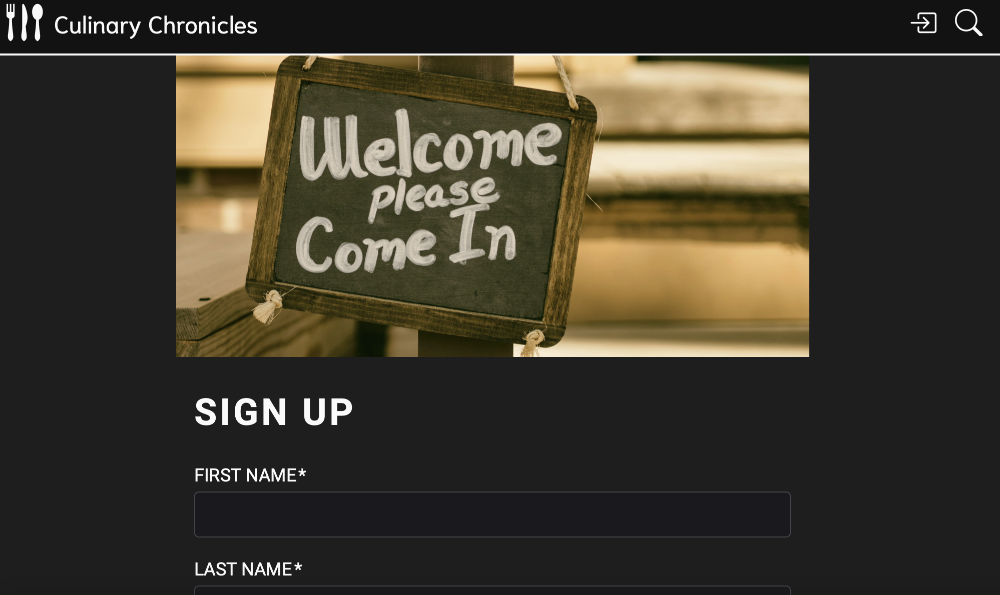

# culinary_chronicles 

### Contents

1. [Discription](#description)
2. [Installation](#installation)
3. [Screenshots](#screenshots)
4. [HerokuLink](#herokulink)
5. [FutureWork](#futurework)
6. [Contributors](#Contributors)

## Description

Culinary_Cronicles is a group project. It is a one page application using React. We are all foodies in our group and we decided to make an application where user can make account and add their recipes for other people to use and can search other recipes. You can find recipes with preparation time.
It help users to try new recipes. We all like to try new food but are we ready to cook? By having all the recipes, with ingredients used and preparation time, we would be encouraged to cook and try healthy homemade food on budget as restaurants are expensive.

## Installation

To install locally, Git clone this repository using terminal and open the file in VS Code (or in the editor you work with). Install dependencies using "npm install" in terminal (make sure that you are in the reposetory directory, before running any command) followed by "npm run seed" and "npm run develop" to start the apllication. Now you are ready to use this application.

To use the application online, go to the Heroku link and it is ready to use.

## HerokuLink

https://culinary-chronicles-3c88f23f36ac.herokuapp.com/

## Screenshot

Following is the screenshots of my application:

## FutureWork

We have some work for the future as the application grow (in terms of recipes and users)

- Give users the ability to:
   -  reate recipe collections
   -  Edit their user info on their profile page
   -  Like recipes
   -  Edit their recipes
   -  Use and Display Tags
- Create public user profile pages that others can visit to see created, liked and collected recipes
- Email notifications to keep users apprised of new and trending recipes
- Meal planner

## Contributors

[Lorne Cyr](https://github.com/Llourn) 

[Justin Connors](https://github.com/Justin-Connors)

[Sehar Uzair](https://github.com/calligraphist)

[Amanda Edmond](https://github.com/AmyEdmond)

---

© 2023 edX Boot Camps LLC. Confidential and Proprietary. All Rights Reserved
